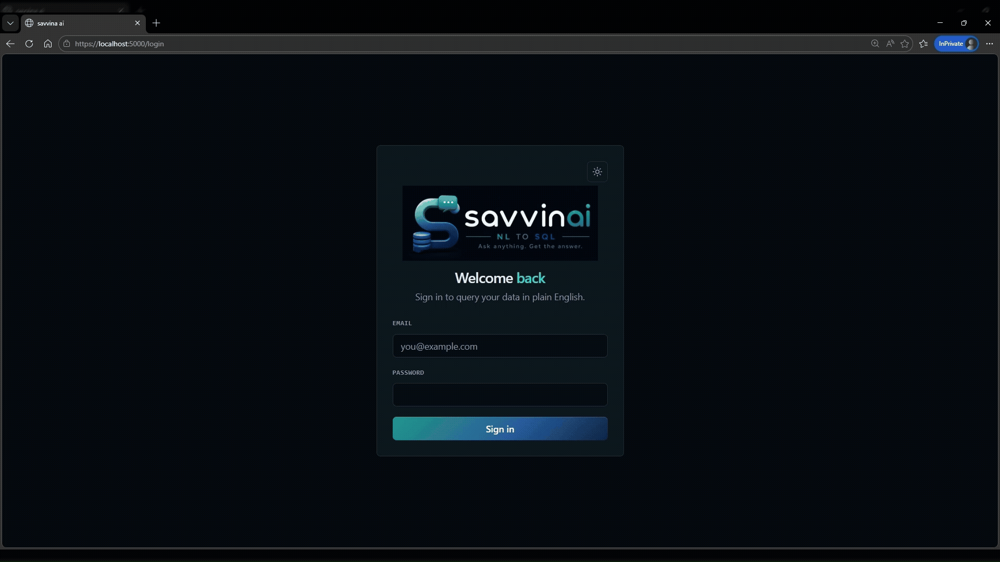

# Savvina AI

> ⚠️ **License:** Savvina AI Community Edition is free for development,
> testing, and non-commercial use under the
> [Business Source License 1.1](LICENSE). Production or commercial use
> requires a [commercial license](COMMERCIAL.md). On 2030-06-01 this
> project converts to Apache 2.0.

**Self-hosted conversational analytics — query your database with plain English.**

Savvina AI lets you connect to a database, ask questions in natural language, and receive generated SQL queries along with formatted results. It auto-generates a business-language semantic model from your schema, caches frequent queries for speed, and gives you full control over what data reaches the LLM and how queries are executed.



---

## Features

| Feature | Description |
|---|---|
| **Natural language to SQL** | Ask questions in plain English; get readable SQL and tabular results |
| **Multi-LLM support** | Claude, OpenAI, Groq, Gemini, Cerebras, Mistral, Ollama — plus any OpenAI-compatible endpoint (GitHub Models, HuggingFace, Together.ai, OpenRouter, etc.) |
| **2 data sources** | PostgreSQL and MySQL / MariaDB — additional sources exist in commercial version |
| **Free-tier ready** | Works out of the box with Groq (14,400 req/day free) or Google Gemini (1,500 req/day free) |
| **Local LLM via Ollama** | Run entirely offline with Ollama — no data leaves your machine |
| **Auto semantic model** | LLM-generated business glossary translates cryptic column names into plain language |
| **Two-level cache** | Exact + semantic similarity caching reduces redundant LLM calls |
| **Privacy controls** | Per-connection controls over what metadata (sample values, comments, row counts) reaches the LLM |
| **Three execution modes** | Auto-execute, Review-first, or Generate-only — choose your trust level per connection |
| **Read-only safety** | All generated SQL is validated before execution; only SELECT statements are permitted |
| **Fernet encryption** | Database credentials and API keys are always encrypted at rest |
| **Extensible adapters** | Adding a new data source or LLM provider requires only one new file |
| **Report Builder** | Assemble query results from chat history into a PDF report; export individual results as CSV, XLSX, or PNG |
| **Shared sessions** | Share a read-only link to any chat message or full session |

---

## Quick Start (Free — No API Costs)

> This Quick Start is for **local development** only. Production use requires a [commercial license](COMMERCIAL.md) — contact [savvina.ai](https://savvina.ai) to get started.

### Prerequisites

- Docker + Docker Compose (v2)
- 4 GB RAM minimum (8 GB recommended for local Ollama)

### 1. Clone and configure

```bash
git clone https://github.com/savvina-ai/savvina
cd savvina
cp .env.example .env
```

### 2. Generate required secrets

```bash
# Fernet key — encrypts credentials at rest
python -c "from cryptography.fernet import Fernet; print(Fernet.generate_key().decode())"

# JWT secret — signs access tokens (use a different value)
python -c "import secrets; print(secrets.token_hex(32))"

# Database passwords — one for each service
python -c "import secrets; print(secrets.token_urlsafe(24))"
```

Open `.env` and fill in:

```bash
ENCRYPTION_KEY=<fernet-key>
JWT_SECRET_KEY=<jwt-secret>
APP_DB_PASSWORD=<strong-password>
SAMPLE_POSTGRES_PASSWORD=<strong-password>
SAMPLE_MYSQL_ROOT_PASSWORD=<strong-password>
SAMPLE_MYSQL_PASSWORD=<strong-password>
```

### 3. Get a free LLM API key

**Option A — Groq (recommended, 14,400 requests/day free):**
1. Sign up at https://console.groq.com
2. Create an API key
3. Add to `.env`: `GROQ_API_KEY=gsk_...`

**Option B — Google Gemini (1,500 requests/day free):**
1. Sign up at https://aistudio.google.com
2. Create an API key
3. Add to `.env`: `GEMINI_API_KEY=AIza...`

### 4. Set volume permissions (first run only)

```bash
docker compose run --rm init-permissions
```

### 5. Generate TLS certificates (required)

Nginx serves over HTTPS and will not start without a certificate. Use [mkcert](https://github.com/FiloSottile/mkcert) to generate locally-trusted certs:

```bash
mkcert -install          # installs local CA once (run as your normal user)
mkdir -p volumes/certs
cd volumes/certs && mkcert localhost 127.0.0.1 && cd ../..
```

See [HTTPS Setup](docs/infrastructure/docker.md#https-setup) for installation instructions, WSL notes, and custom hostname support.

### 6. Start the stack

```bash
docker compose up --build
```

Wait for all services to show as healthy (about 60–120 seconds on first build).

### 7. Open the UI

Navigate to **https://localhost:3000**

On first boot, create your admin account by entering your name, email, and password. A two-step setup wizard then walks you through connecting a database and configuring an LLM provider.

Then go to **Settings → Add Provider**, select Groq or Gemini, paste your key, and start chatting.

---

## Supported Data Sources

| Source | Driver | Notes |
|---|---|---|
| **PostgreSQL** | asyncpg | Full schema introspection, row counts, column comments |
| **MySQL / MariaDB** | aiomysql | Full schema introspection, row counts, column comments |

The adapter interface is documented in [docs/development/adding-a-datasource.md](docs/development/adding-a-datasource.md).

---

## Supported LLM Providers

Claude, OpenAI, Groq, Gemini, Cerebras, Mistral, Ollama, and any OpenAI-compatible endpoint (GitHub Models, HuggingFace, Together.ai, OpenRouter, vLLM, LM Studio, etc.).

See [docs/user-guide/06_llm-providers.md](docs/user-guide/06_llm-providers.md) for the full provider list, configuration details, and default models.

---

## Using Sample Databases (No Real Database Required)

The `test-dbs` profile starts two pre-seeded demo databases — PostgreSQL and MySQL — so you can try Savvina AI without connecting to a real data source:

```bash
docker compose --profile test-dbs up --build
```

Or combine with the bundled app database:

```bash
docker compose --profile local-db --profile test-dbs up --build
```

The sample databases are available on ports **5435** (PostgreSQL) and **3307** (MySQL). Configure them in the UI under **Settings → Add Connection** using the credentials from your `.env` file (`SAMPLE_POSTGRES_PASSWORD`, `SAMPLE_MYSQL_PASSWORD`).

See [docs/infrastructure/docker.md](docs/infrastructure/docker.md) for full details.

---

## Using Ollama (Local LLM)

Start with the `local-llm` profile to include the Ollama service:

```bash
docker compose --profile local-llm up --build
```

Then pull a model (in a separate terminal while the stack is running):

```bash
docker exec -it savvina-ollama-1 ollama pull llama3
# or for a code-tuned model:
docker exec -it savvina-ollama-1 ollama pull qwen2.5-coder:7b
```

In the Savvina AI UI, go to **Settings → Add Provider → Ollama (Local)** and select your pulled model.

---

## Configuration

All settings live in `.env`. See [docs/getting-started/02_configuration.md](docs/getting-started/02_configuration.md) for the full reference.

---

## Privacy

Savvina AI is designed to give you precise control over what metadata reaches the LLM. **No query results are ever sent to the LLM** — only the schema description and your natural language question.

Per-connection privacy controls:
- **Include sample values** — improves accuracy but sends 5 distinct values per column to the LLM
- **Include column comments** — sends database column description text to the LLM
- **Include row counts** — sends approximate row counts
- **Sensitive column patterns** — columns matching patterns like `email`, `ssn`, `password` are auto-excluded from sample values
- **Excluded schemas / tables / columns** — fine-grained exclusion list; these are never mentioned to the LLM

See [docs/user-guide/04_privacy-controls.md](docs/user-guide/04_privacy-controls.md) for full details.

---

## Architecture Overview

```
Browser (React + Zustand)
        │
        │ HTTP / REST + SSE streaming
        ▼
FastAPI Backend (Python 3.12, async)
   ├── Routers (connections, chat, providers, semantic, settings, auth)
   ├── ChatService ─── QueryCache ──── fastembed / ONNX (local)
   │                └─ ExampleLibrary
   ├── LLM Providers (Claude, OpenAI, Groq, Gemini, Cerebras, Mistral, Ollama, OpenAI-Compatible…)
   ├── DataSource Adapters (PostgreSQL, MySQL)
   ├── SemanticModelGenerator
   └── PostgreSQL (app DB — connections, sessions, cache, examples, users)
        │
        │ asyncpg / aiomysql
        ▼
  User's database (PostgreSQL or MySQL)
```

See [docs/architecture/overview.md](docs/architecture/overview.md) for a detailed breakdown.

---

## Documentation

| Section | Description |
|---|---|
| [Getting Started](docs/getting-started/01_quickstart.md) | Installation, first-run walkthrough |
| [Configuration](docs/getting-started/02_configuration.md) | All environment variables |
| [User Guide — Connecting to Data](docs/user-guide/02_connecting-to-data.md) | How to add and manage connections |
| [User Guide — Chatting with Data](docs/user-guide/01_chatting-with-data.md) | How to ask questions and interpret results |
| [User Guide — Execution Modes](docs/user-guide/03_execution-modes.md) | Auto-execute vs Review-first vs Generate-only |
| [User Guide — Privacy Controls](docs/user-guide/04_privacy-controls.md) | What reaches the LLM and how to restrict it |
| [User Guide — Semantic Models](docs/user-guide/05_semantic-models.md) | Auto-generated business glossary |
| [User Guide — LLM Providers](docs/user-guide/06_llm-providers.md) | Configuring and switching providers |
| [User Guide — Charts and BI](docs/user-guide/07_charts-and-bi.md) | Charts and BI capabilities |
| [API Reference](docs/api-reference/endpoints.md) | Full REST API endpoint reference |
| [Architecture Overview](docs/architecture/overview.md) | Component breakdown and design decisions |
| [Data Flow](docs/architecture/data-flow.md) | Request lifecycle from question to results |
| [Data Source — PostgreSQL](docs/datasources/postgresql.md) | PostgreSQL-specific configuration and tips |
| [Data Source — MySQL](docs/datasources/mysql.md) | MySQL-specific configuration and tips |
| [Adding a Data Source](docs/development/adding-a-datasource.md) | Extend to any new source |
| [Adding an LLM Provider](docs/development/adding-a-provider.md) | Plug in any new LLM |
| [Testing](docs/development/testing.md) | Running the backend and frontend test suites |
| [User Testing Playbook](docs/testing/user-testing-playbook.md) | Manual QA sessions and sample questions per datasource |
| [Deployment](docs/administration/deployment.md) | Self-hosted setup reference (development only; production use requires a [commercial license](COMMERCIAL.md)) |
| [Infrastructure](docs/infrastructure/docker.md) | Docker Compose services explained |

---

## Development

```bash
# Backend tests (run inside Docker or with uv)
docker compose run --rm backend pytest tests/ -v
# or, if running locally with venv:
python3 -m venv .venv
.venv/bin/pip install -r backend/requirements-dev.txt
.venv/bin/pytest backend/tests/ -v

# Frontend dev server (hot reload)
cd frontend
npm install
npm run dev   # http://localhost:5173 — proxies /api to localhost:8000

# Frontend tests
npm test

# Lint and format
.venv/bin/ruff check backend/app/ backend/tests/
.venv/bin/ruff format --check backend/app/ backend/tests/
cd frontend && npm run lint && npx tsc --noEmit
```

---

## License

Savvina AI Community Edition is licensed under the [Business Source License 1.1](LICENSE). It converts to Apache 2.0 on 2030-06-01. See [COMMERCIAL.md](COMMERCIAL.md) for commercial licensing.
