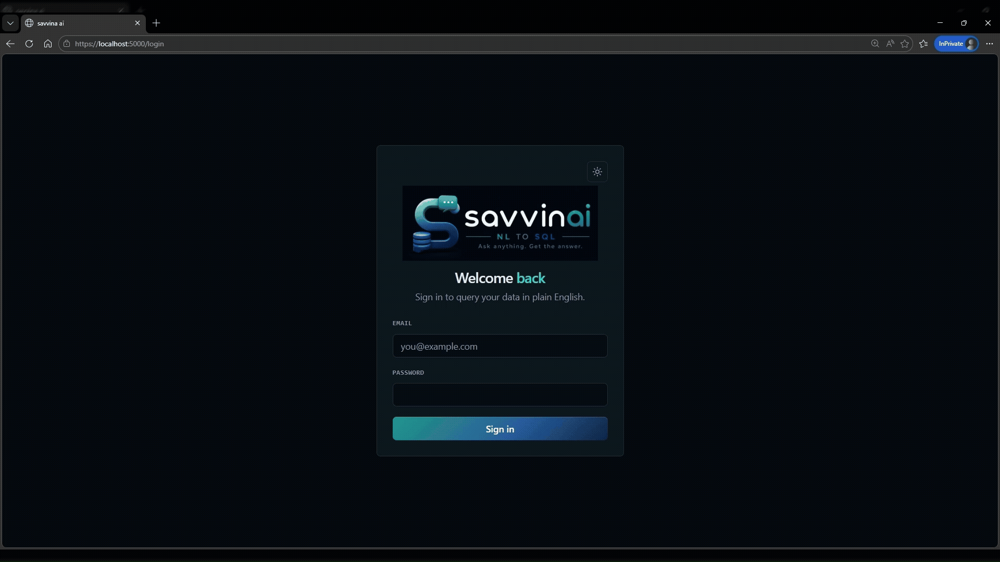

# Savvina AI

🤖 **Text-to-SQL for self-hosters** — ask your database anything in plain English, get SQL and results instantly.

[](https://github.com/savvina-ai/savvina)
[](LICENSE)
[](https://www.python.org/)
[](https://github.com/savvina-ai/savvina/releases)



Savvina AI lets you connect to a database, ask questions in natural language, and receive generated SQL queries along with formatted results. It auto-generates a business-language semantic model from your schema, caches frequent queries for speed, and gives you full control over what data reaches the LLM and how queries are executed.

---

## Quick Start (Free — No API Costs)

> This Quick Start is for **local development** only. Production use requires a [commercial license](COMMERCIAL.md) — contact [savvina.ai](https://savvina.ai) to get started.

### Prerequisites

- [Docker Desktop](https://www.docker.com/products/docker-desktop/) (includes Compose v2) — or Docker Engine + [Compose plugin](https://docs.docker.com/compose/install/linux/) on a Linux server without Docker Desktop
- 4 GB RAM minimum (8 GB recommended for local Ollama)

See [Quickstart → Prerequisites](docs/getting-started/01_quickstart.md#prerequisites) if you need to install Docker first.

### 1. Clone and configure

```bash
git clone https://github.com/savvina-ai/savvina
cd savvina
cp .env.example .env

# WSL / Linux: run containers as you, so mounted volumes stay writable
printf '\nLOCAL_UID=%s\nLOCAL_GID=%s\n' "$(id -u)" "$(id -g)" >> .env
```

Open `.env` and set one value — a password for the bundled app database:

```bash
APP_DB_PASSWORD=<strong-password>     # python -c "import secrets; print(secrets.token_urlsafe(24))"
```

That's the whole database setup: `.env.example` already ships `COMPOSE_PROFILES=local-db` to start the bundled PostgreSQL container, and Compose derives the connection URL from your password. To use an external or managed database instead, comment out `COMPOSE_PROFILES` and `APP_DB_PASSWORD` and set `DATABASE_URL` to your provider's connection string.

**Just want to play around, without a database of your own?** Add the `test-dbs` profile as well — it starts two demo databases (PostgreSQL and MySQL) pre-seeded with sample data, so you have something to ask questions about from the first login:

```bash
COMPOSE_PROFILES=local-db,test-dbs
```

Leave the `SAMPLE_*` passwords in `.env` empty and they fall back to `savvina_demo`. You add these as connections in the UI after step 4 — see [Using Sample Databases](#using-sample-databases-no-real-database-required) for the ports and credentials.

> **Encryption and JWT keys are generated for you.** On first boot the backend creates `ENCRYPTION_KEY` and `JWT_SECRET_KEY` and persists them to `/app/data/secrets.env` in the data volume — do not add them to `.env`. Back up `ENCRYPTION_KEY` after the first start; losing it makes all stored credentials and API keys permanently unreadable. See [Quickstart](docs/getting-started/01_quickstart.md#encryption_key-and-jwt_secret_key-docker--auto-generated) for bare-metal setups.

### 2. Get a free LLM API key

**Option A — Groq (recommended, no card required):** sign up at [console.groq.com](https://console.groq.com) and create an API key. Free-tier limits vary by model and are enforced per organization — check yours at [console.groq.com/settings/limits](https://console.groq.com/settings/limits); general-purpose models are commonly around 1,000 requests/day, with some legacy models allowed much higher.

**Option B — Google Gemini (no card required):** sign up at [aistudio.google.com](https://aistudio.google.com) and create an API key. Free-tier requests/day vary by model (recent Flash/Flash-Lite models have ranged from roughly 20 to 250+ req/day) and change without much notice — check current limits at [ai.google.dev/gemini-api/docs/rate-limits](https://ai.google.dev/gemini-api/docs/rate-limits) or [aistudio.google.com](https://aistudio.google.com/rate-limit).

Keep the key handy — you enter it in step 4. API keys are entered only through the UI and stored encrypted; they are not read from `.env`.

### 3. Start the stack

**Option A — pre-built images (no compiling):** every release publishes multi-arch images (`linux/amd64` and `linux/arm64`, so Apple Silicon, Raspberry Pi and most NAS boxes are covered) to Docker Hub as [`savvinaai/savvina-backend`](https://hub.docker.com/r/savvinaai/savvina-backend) and [`savvinaai/savvina-frontend`](https://hub.docker.com/r/savvinaai/savvina-frontend):

```bash
docker compose pull
docker compose up --no-build
```

`latest` is the newest release. To pin a release, add `SAVVINA_IMAGE_TAG=v2.0.0` (any tag from the [releases page](https://github.com/savvina-ai/savvina/releases)) to `.env` before pulling.

> **Note:** with pre-built images the backend runs the code baked into the image, so pinning `SAVVINA_IMAGE_TAG` pins the application code, dependencies, and migrations together. Backend hot-reload from your local checkout is a separate opt-in (`docker-compose.dev.yaml`, see [Development Overrides](docs/infrastructure/docker.md#development-overrides)); don't combine it with Option A, or the checkout's code runs against the image's migrations.

**Option B — build from source:** use this if you have changed the code:

```bash
docker compose up --build
```

Wait for all services to show as healthy — migrations run on every start, so first boot can take a minute or two even with pre-built images, and longer on a first build. Volume permissions are prepared automatically by the `init-permissions` service.

Both commands run in the foreground, which is what you want on a first start — the logs show migrations running and tell you if something fails. Add `-d` (after `up`) to detach instead and get your prompt back:

```bash
docker compose up -d --no-build
docker compose logs -f backend   # follow startup
docker compose ps                # check every service reports healthy
```

### 4. Open the UI

The stack serves plain HTTP; that is fine for local and LAN use. For anything reachable from the internet, put a TLS-terminating reverse proxy in front (see [Deployment → Configure HTTPS](docs/administration/deployment.md#5-configure-https)).

Navigate to **http://localhost:3000**

> Reaching the UI at any other host or IP (e.g. a LAN address)? Set `CORS_ORIGINS` in `.env` to that exact origin and restart the backend, or login will fail with a 403 — see [Quickstart → Step 7](docs/getting-started/01_quickstart.md#step-7--create-your-admin-account) for a worked example. Upgrading from an older, HTTPS-only release? See [Upgrading from a TLS-terminating release](docs/administration/maintenance.md#upgrading-from-a-tls-terminating-release).

On first boot, create your admin account by entering your name, email, and password. A two-step setup wizard then walks you through connecting a database and configuring an LLM provider — paste the key from step 2 there, or add it later under **Settings → LLM Providers** with **+ Add Groq config** (or Gemini).

---

## Features

| Feature | Description |
|---|---|
| **Natural language to SQL** | Ask questions in plain English; get readable SQL and tabular results |
| **Multi-LLM support** | Claude, OpenAI, Groq, Gemini, Ollama and more — see [Supported LLM Providers](#supported-llm-providers) |
| **2 data sources** | PostgreSQL and MySQL / MariaDB — additional sources exist in commercial version |
| **Free-tier ready** | Works out of the box with Groq or Google Gemini — both offer a free API tier with no card required |
| **Local LLM via Ollama** | Run entirely offline with Ollama — no data leaves your machine |
| **Auto semantic model** | LLM-generated business glossary translates cryptic column names into plain language |
| **Two-level cache** | Exact + semantic similarity caching reduces redundant LLM calls |
| **Privacy controls** | Per-connection controls over what metadata (sample values, comments, row counts) reaches the LLM |
| **Three execution modes** | Auto-execute, Review-first, or Generate-only — choose your trust level per connection |
| **Read-only safety** | All generated SQL is validated before execution; only SELECT statements are permitted |
| **Fernet encryption** | Database credentials and API keys are always encrypted at rest |
| **Extensible adapters** | Adding a new data source or LLM provider requires only one new file |
| **Report Builder** | Assemble query results from chat history into a PDF report; export individual results as CSV, XLSX, or PNG |
| **Shared sessions** | Share a read-only link to any chat message or full session |

---

## Supported Data Sources

**PostgreSQL** (asyncpg) and **MySQL / MariaDB** (aiomysql) — both with full schema introspection, row counts, and column comments.

The adapter interface is documented in [docs/development/adding-a-datasource.md](docs/development/adding-a-datasource.md).

---

## Supported LLM Providers

Claude, OpenAI, Groq, Gemini, Cerebras, Mistral, Ollama, and any OpenAI-compatible endpoint (HuggingFace, Together.ai, OpenRouter, vLLM, LM Studio, etc.).

See [docs/user-guide/06_llm-providers.md](docs/user-guide/06_llm-providers.md) for the full provider list, configuration details, and default models.

---

## Using Sample Databases (No Real Database Required)

The `test-dbs` profile starts two pre-seeded demo databases — PostgreSQL and MySQL — so you can try Savvina AI without connecting to a real data source. Add it to `COMPOSE_PROFILES` in `.env` alongside your database mode, then start the stack as in [step 3](#3-start-the-stack):

```bash
COMPOSE_PROFILES=local-db,test-dbs
```

These are throwaway demo containers bound to localhost, so they fall back to built-in passwords if you leave `SAMPLE_POSTGRES_PASSWORD`, `SAMPLE_MYSQL_PASSWORD`, and `SAMPLE_MYSQL_ROOT_PASSWORD` empty or unset — `.env.example` ships them empty, which is enough. Set them in `.env` to override.

> Prefer editing `COMPOSE_PROFILES` over passing `--profile` on the command line: the CLI flag **replaces** the value from `.env` rather than adding to it, so `docker compose --profile test-dbs up` would silently stop the `local-db` container from starting.

The sample databases are available on ports **5435** (PostgreSQL, database `savvina_test`) and **3307** (MySQL, database `sample_delivery`). Add them from **Connections** in the left sidebar using user `savvina` and whichever password applies — your `.env` override or the `savvina_demo` default. (`SAMPLE_MYSQL_ROOT_PASSWORD` is separate and defaults to `savvina_demo_root`; Savvina doesn't need it.)

See [docs/infrastructure/docker.md](docs/infrastructure/docker.md) for full details.

---

## Using Ollama (Local LLM)

Add the `local-llm` profile to `COMPOSE_PROFILES` in `.env` to include the Ollama service, then start the stack as in [step 3](#3-start-the-stack):

```bash
COMPOSE_PROFILES=local-db,local-llm
```

Pull a model in a separate terminal while the stack is running:

```bash
docker exec -it savvina-ollama-1 ollama pull llama3
# or for a code-tuned model:
docker exec -it savvina-ollama-1 ollama pull qwen2.5-coder:7b
```

In the Savvina AI UI, go to **Settings → LLM Providers**, click **+ Add Ollama (Local) config**, and select your pulled model.

---

## Configuration

All settings live in `.env`. See [docs/getting-started/02_configuration.md](docs/getting-started/02_configuration.md) for the full reference.

Commonly adjusted beyond the Quick Start:

| Variable | Purpose |
|---|---|
| `COMPOSE_PROFILES` | Which optional containers start — `local-db`, `test-dbs`, `local-llm`, comma-separated |
| `DATABASE_URL` | Set only when using an external database; otherwise derived from `APP_DB_PASSWORD` |
| `APP_PORT` | Port the UI is served on (default `3000`) |
| `HF_TOKEN` | Avoids anonymous rate-limiting when the build downloads the embedding model |
| `LOG_LEVEL` / `LOG_FORMAT` | `text` is easier to read during local development |

---

## Privacy

Savvina AI is designed to give you precise control over what metadata reaches the LLM. **No query results are ever sent to the LLM** — only the schema description and your natural language question.

Per-connection privacy controls:
- **Include sample values** — improves accuracy but sends 5 distinct values per column to the LLM
- **Include column comments** — sends database column description text to the LLM
- **Include row counts** — sends approximate row counts
- **Sensitive column patterns** — columns matching patterns like `email`, `ssn`, `password` are auto-excluded from sample values
- **Excluded schemas / tables / columns** — fine-grained exclusion list; these are never mentioned to the LLM

See [docs/user-guide/04_privacy-controls.md](docs/user-guide/04_privacy-controls.md) for full details.

---

## Architecture Overview

```
Browser (React + Zustand)
        │
        │ HTTP / REST + SSE streaming
        ▼
FastAPI Backend (Python 3.12, async)
   ├── Routers (connections, chat, providers, semantic, settings, auth)
   ├── ChatService ─── QueryCache ──── fastembed / ONNX (local)
   │                └─ ExampleLibrary
   ├── LLM Providers (Claude, OpenAI, Groq, Gemini, Cerebras, Mistral, Ollama, OpenAI-Compatible…)
   ├── DataSource Adapters (PostgreSQL, MySQL)
   ├── SemanticModelGenerator
   └── PostgreSQL (app DB — connections, sessions, cache, examples, users)
        │
        │ asyncpg / aiomysql
        ▼
  User's database (PostgreSQL or MySQL)
```

See [docs/architecture/overview.md](docs/architecture/overview.md) for a detailed breakdown.

---

## Documentation

| Section | Description |
|---|---|
| [Getting Started](docs/getting-started/01_quickstart.md) | Installation, first-run walkthrough |
| [Configuration](docs/getting-started/02_configuration.md) | All environment variables |
| [User Guide — Connecting to Data](docs/user-guide/02_connecting-to-data.md) | How to add and manage connections |
| [User Guide — Chatting with Data](docs/user-guide/01_chatting-with-data.md) | How to ask questions and interpret results |
| [User Guide — Execution Modes](docs/user-guide/03_execution-modes.md) | Auto-execute vs Review-first vs Generate-only |
| [User Guide — Privacy Controls](docs/user-guide/04_privacy-controls.md) | What reaches the LLM and how to restrict it |
| [User Guide — Semantic Models](docs/user-guide/05_semantic-models.md) | Auto-generated business glossary |
| [User Guide — LLM Providers](docs/user-guide/06_llm-providers.md) | Configuring and switching providers |
| [User Guide — Charts and BI](docs/user-guide/07_charts-and-bi.md) | Charts and BI capabilities |
| [API Reference](docs/api-reference/endpoints.md) | Full REST API endpoint reference |
| [Architecture Overview](docs/architecture/overview.md) | Component breakdown and design decisions |
| [Data Flow](docs/architecture/data-flow.md) | Request lifecycle from question to results |
| [Data Source — PostgreSQL](docs/datasources/postgresql.md) | PostgreSQL-specific configuration and tips |
| [Data Source — MySQL](docs/datasources/mysql.md) | MySQL-specific configuration and tips |
| [Adding a Data Source](docs/development/adding-a-datasource.md) | Extend to any new source |
| [Adding an LLM Provider](docs/development/adding-a-provider.md) | Plug in any new LLM |
| [Testing](docs/development/testing.md) | Running the backend and frontend test suites |
| [User Testing Playbook](docs/testing/user-testing-playbook.md) | Manual QA sessions and sample questions per datasource |
| [Deployment](docs/administration/deployment.md) | Self-hosted setup reference (development only; production use requires a [commercial license](COMMERCIAL.md)) |
| [Infrastructure](docs/infrastructure/docker.md) | Docker Compose services explained |

---

## Development

```bash
# Backend tests (run inside Docker or with uv)
docker compose run --rm backend pytest tests/ -v
# or, if running locally with venv:
python3 -m venv .venv
.venv/bin/pip install -r backend/requirements-dev.txt
.venv/bin/pytest backend/tests/ -v

# Frontend dev server (hot reload)
cd frontend
npm install
npm run dev   # http://localhost:3000 — proxies /api to localhost:8000

# Frontend tests
npm test

# Lint and format
.venv/bin/ruff check backend/app/ backend/tests/
.venv/bin/ruff format --check backend/app/ backend/tests/
cd frontend && npm run lint && npx tsc --noEmit
```

---

## License

> **Community Edition** is free for development, testing, and non-commercial use under the [Business Source License 1.1](LICENSE). Production or commercial use requires a [commercial license](COMMERCIAL.md). Converts to Apache 2.0 on 2030-06-01.
